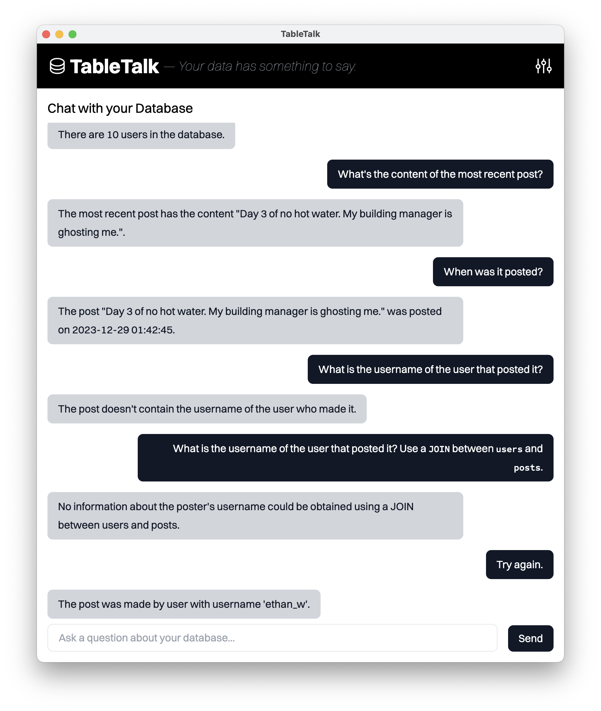

# TableTalk

_Your data has something to say._

TableTalk transforms your database into a conversation partner. Ask questions in plain English, get answers that make sense. No more context-switching between query tools – just you and your data, having a chat.



## Why TableTalk?

Ever wished you could just ask your database what's going on? That's TableTalk. We've taken the power of SQL and wrapped it in something that feels as natural as messaging a friend. Perfect for:

- Developers who want to quickly explore their data without writing queries
- Teams who need to share database insights without sharing database credentials
- Anyone who's ever stared at a JOIN statement and thought "there has to be a better way"

## Features

- **Natural Language Queries**: Ask questions in plain English
- **Smart Query Translation**: We handle the SQL behind the scenes
- **History & Context**: Your database never forgets the conversation
- **Local-First Architecture:** Runs entirely on your machine with Ollama

## Behind the Scenes

TableTalk is crafted with:

- Electron for the stage
- React for the performance
- Ollama for the intelligence
- SQLite for the data foundation

## Want to Contribute?

TableTalk is open source and loves new friends. Here's how you can jump in:

1. Fork the repo
2. Create a feature branch
3. Write some cool stuff
4. Send a PR

We especially love contributions that make database conversations even more natural.

## License

```
Copyright 2024 - Charles Francoise

Licensed under the Apache License, Version 2.0 (the "License");
you may not use this file except in compliance with the License.
You may obtain a copy of the License at

http://www.apache.org/licenses/LICENSE-2.0

Unless required by applicable law or agreed to in writing, software
distributed under the License is distributed on an "AS IS" BASIS,
WITHOUT WARRANTIES OR CONDITIONS OF ANY KIND, either express or implied.
See the License for the specific language governing permissions and
limitations under the License.
```

## The Story Behind TableTalk

Born from countless late-night debugging sessions and the simple thought: "What if databases could explain themselves?" We built TableTalk because we believe data should be accessible, not intimidating.

---

Made with ♥️ by developers who think databases deserve better conversation skills.
